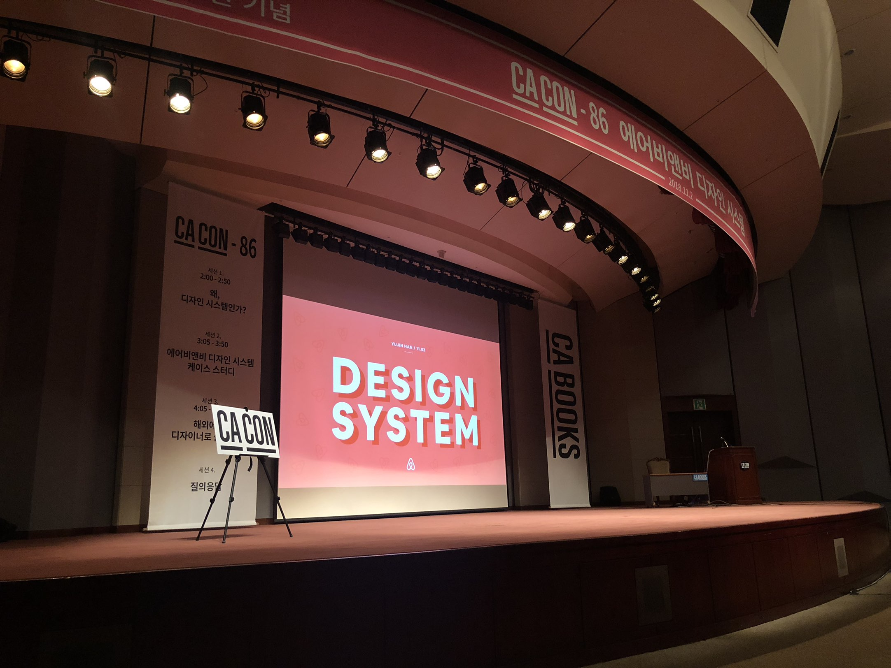

디자이너에서 개발자로 커리어를 전환하고, 처음으로 디자인컨퍼런스에 다녀왔다. 맨날 개발컨퍼런스만 다니다가 디자인컨퍼런스에 다녀오니 머리가 말랑말랑해진 것 같다 :)

이번 디자인세미나에선 에어비앤비팀에서 어떻게 디자인시스템을 만들기 시작했고, **component-reusability, 디자인요소의 라이브러리화**등을 고려하며 디자인-프론트엔드간의 협업을하고 있는지 알 수 있었다. 특히 평소에 **Accessibility 접근성**에 관심을 가지고 개발하고 있었는데, 그 중요성을 다시 한 번 깨달은 귀한 시간이었다. 이번을 계기로 더 나은 퀄리티의 제품을 만들기위헤 접근성 케이스 스터디모임을 만들어보면 어떨까 생각하고 있다.

에어비앤비의 디자인시스템 총괄 책임자 한유진님의 3시간이 넘는 프레젠테이션은 1초도 지루할틈이 없었다. 특히 개인적인 경험을 이야기하는 시간에도 스토리에 걸맞는 사진, 움짤들을 적절히 화면에 띄워주신게 인상깊었다.

3시간의 세미나중 유익하게 들었던 주제들 몇 가지를 글로 남긴다.

1. 에어비앤비가 디자인시스템을 만들게 된 배경
2. 에어비앤비 브랜드컬러가 앱에서 사라진 이유
3. 디자인시스템 비교 (Google, IBM, Shopify)

---

## 1. Airbnb가 디자인시스템을 만들게 된 배경

에어비앤비의 사업 확장에 따라 각각 다른 프로덕트를 만들기 시작했고, 제품들은 점점 더 복잡하고 다양해져갔다. 그에따라 디자인팀의 규모가 점점 커지기 시작했고, 각 제품별 팀은 경주마처럼 앞으로 나아가게 됬다. 앱스토어의 대부분의 서비스들이 매주/2주마다 제품이 업데이트를 하는 추세에따라 제품 개발 사이클은 빨라졌고, 협업을위한 회의보단 **각자의 프로덕트에 몰두하며 간극이 점점 벌어지게 되었다.**

- 2015년의 에어비앤비는 기기마다 버튼위치 제각각의 디자인이었다
- 디자인뿐만 아니라 개발코드도 제 각각이라. 업데이트가 연동이 안되어 힘들었다
- 규모가 커지면서 한 사람이 디렉팅하기 힘들어짐 --> 정형화된 시스템이 필요하다!

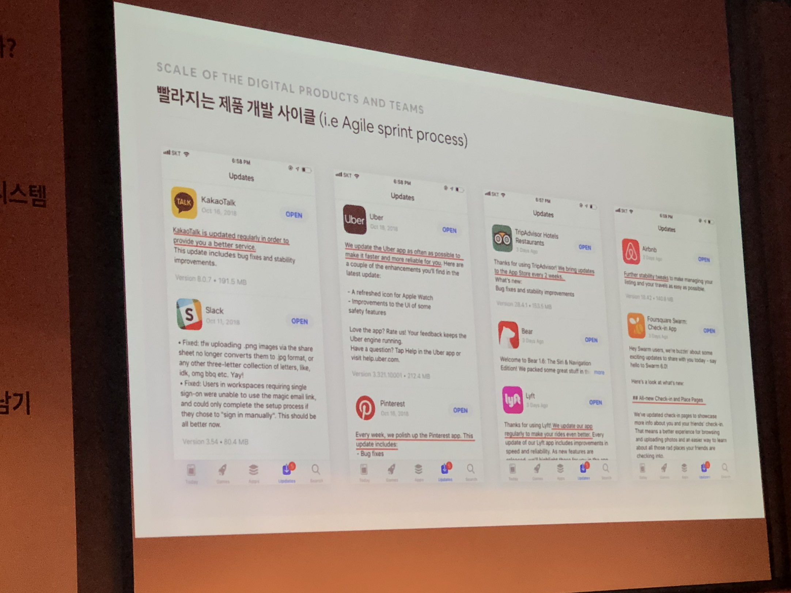
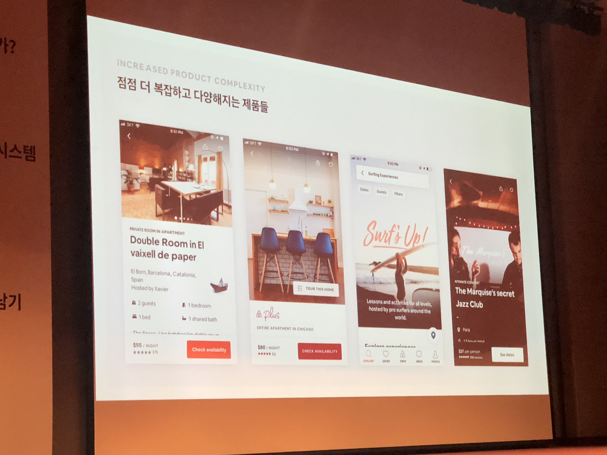

#### # 문제상황 직면

공통된 약속없이 개발되던 에어비앤비 서비스는 디바이스/플랫폼별(android, ios, web) 버튼의 크기와 border-radius가 제각각이었고, **심지어 브랜드컬러까지 팀마다 다르게 사용하고 있었다.**

팀마다 다르게 사용하던 브랜드컬러.jpg
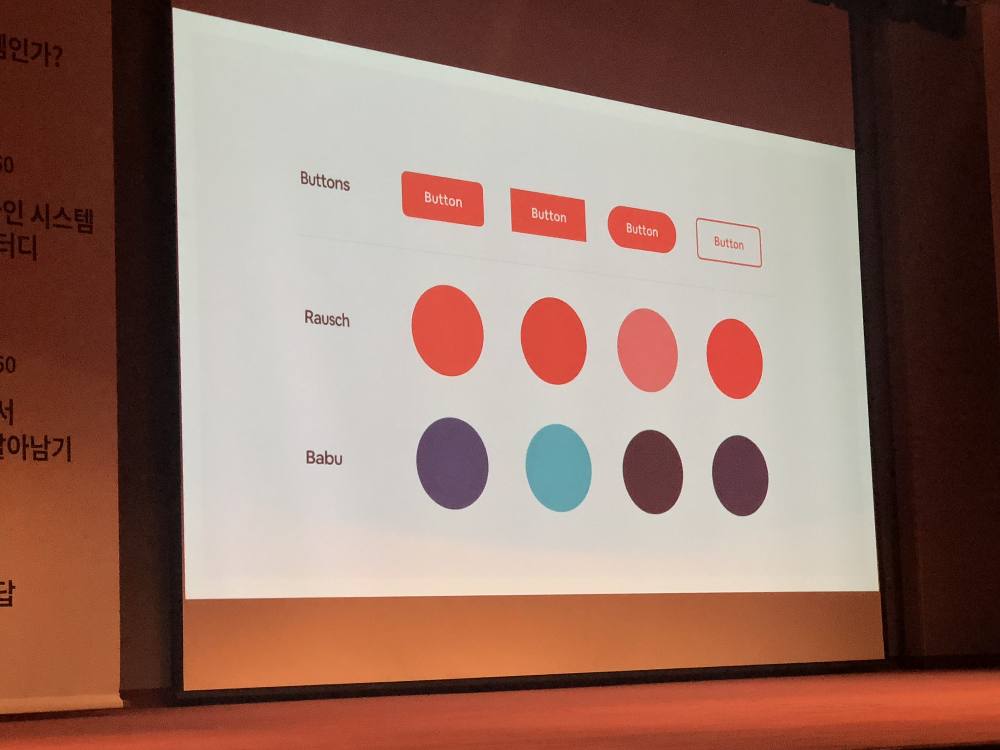
  
  
#### # 디자인시스템 중요성
디자인시스템은 IKEA의 가구조립 안내가이드와 같다고 생각한다. 주어진 시스템에 아이디어를 붙여 나만의 인테리어를 만들 수 있다는 점에서 디자인 시스템과의 연결점이 있다. 디자인시스템을 사용하면 디자인하는 시간을 줄여, ux를 고민할 시간을 더 벌어준다고 생각한다.

* 잘짜여진 컴포넌트 = IKEA의 가구를 샀을때처럼 서비스의 일관된 퀄리티와 느낌을 유지
* 디자인시스템 = 가구조립 안내가이드를 따라 손쉽게 가구를 만들 수 있음

>*Gain time to focus on the innovative ideas*  
>*혁신적인 아이디어에 집중할 시간을 벌게됨*

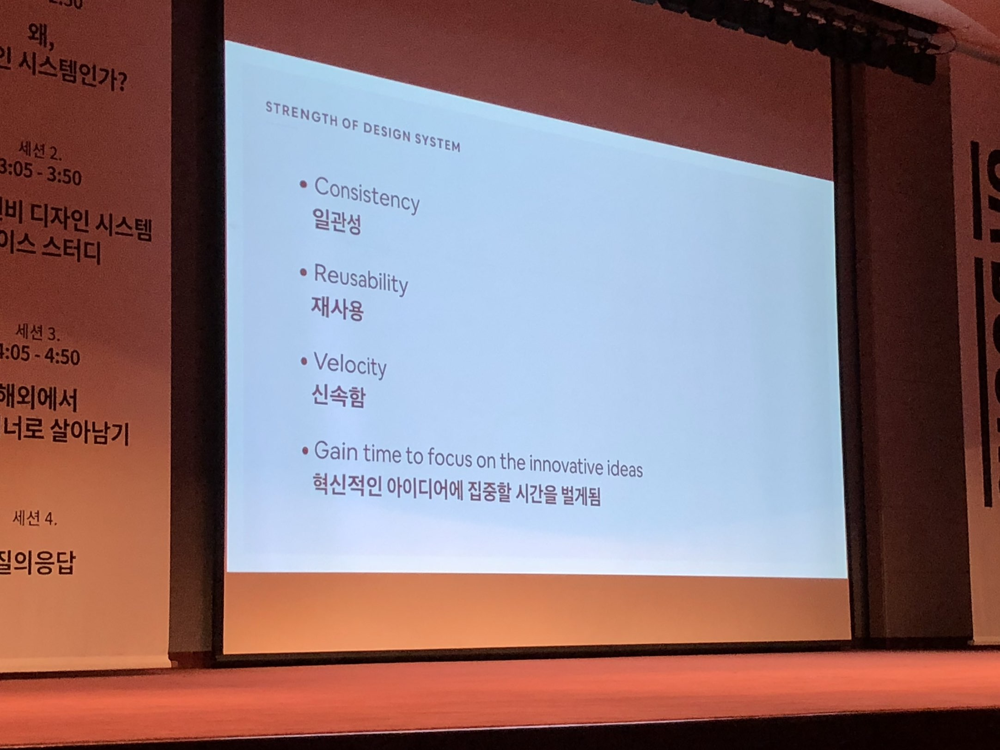

#### # 디자인시스템 도입
**"규칙을 모르고 디자인시스템을 사용하는 것  = 하얀종이에 스티커를 붙이는 것과 같음"**  
디자인 개발자 모두 디자인시스템 규칙을 잘 알고 사용해야한다. 개발자도 직관적으로 이해할 수 있도록 시스템은 정확하고 객관적이어야한다. 시스템의 이해를 돕기위해 가이드라인에 예시들을 포함해주면 좋다.

- ex1. main, primary 버튼을 사용해야하는 rule을 정해줘야함  
- ex2. 컴포넌트 사용 **Do/Dont 사례**를 만들어주면 좋음

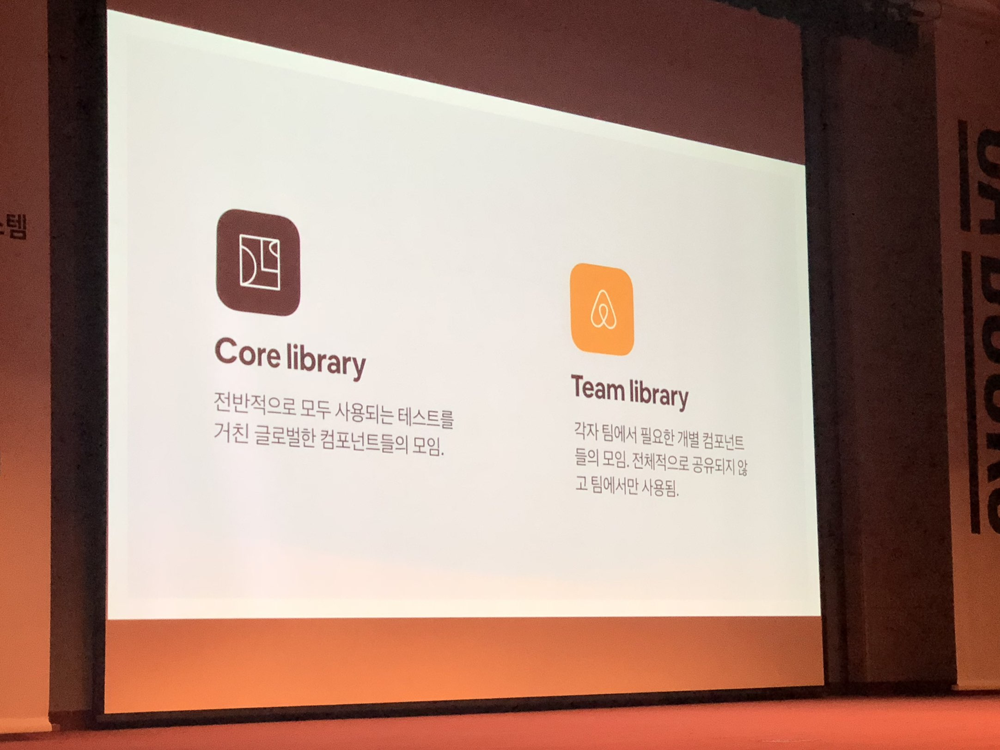

**# Core library**
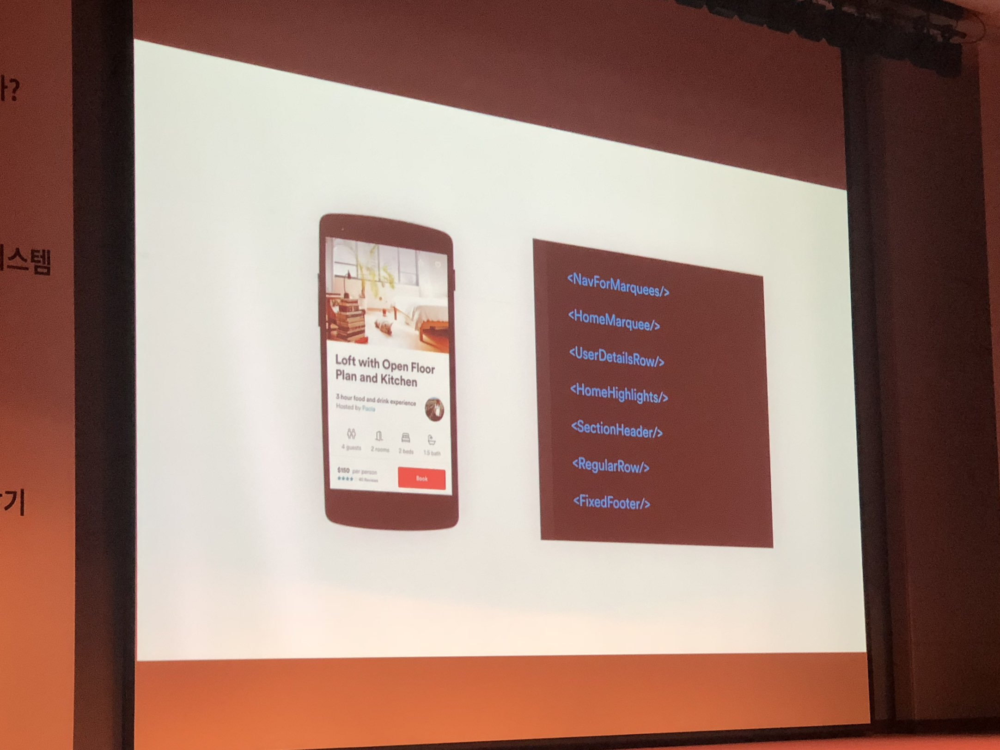
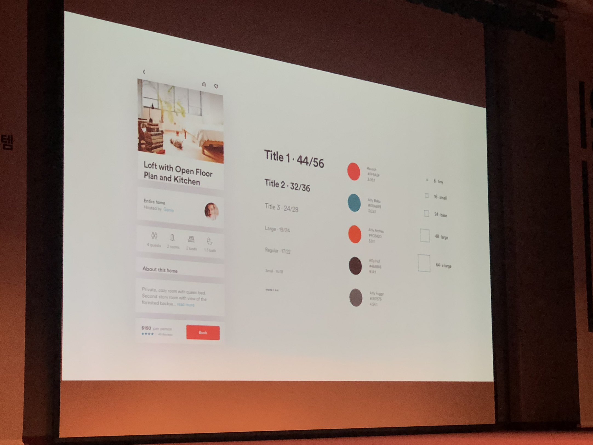
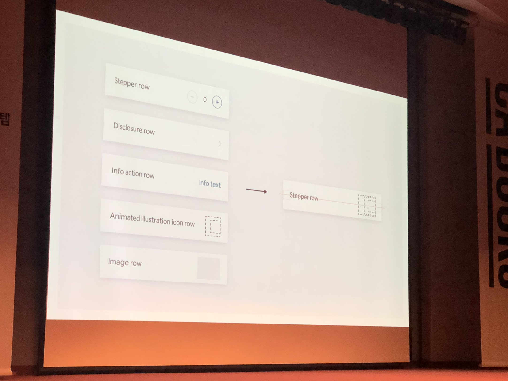

**# Team library**  
프로덕트팀별 다른 디자인이 만들어지더라도 **패밀리 느낌**이 나도록하는 강력한 가이드라인이 필요

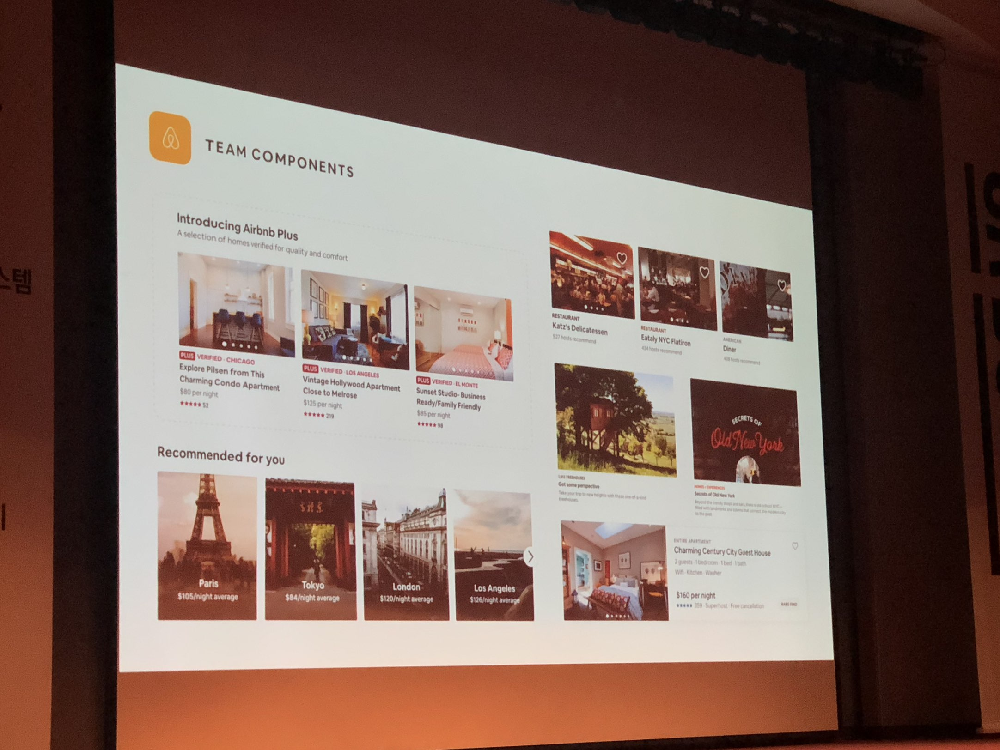

#### # 시스템을 만들어가기위해 가장 중요한것 *Relation*
**"디자인 시스템 디자이너 - 프로덕트 디자이너과의 관계가 제일 중요"**
시스템에대한 이해와 참여도가 점점 줄어들지 않도록 **모든 디자이너&개발자가 시스템을 함께 만들어가는게 중요**하다. 
* 관계가 친밀해야 업데이트하는 시스템에대해 가벼운 피드백을 자주 받을 수 있다
* 에어비앤비는 컨센서스유지를 위해 시스템/프로덕트 팀에서 디자이너 한명씩 뽑아서 uxp partners라는 팀을 운영하고 있다

---

## 2. Airbnb 브랜드컬러가 앱에서 사라진 이유

**질문**: 어느순간 에어비앤비의 Brand color가 앱에서 사라지고, 청록색으로 바뀐 이유가 무엇인가요?

**답변**: "너네 왜 브랜드컬러 더 안써? 왜 브랜드컬러가 어느순간 예쁜 빨강색이 아니야?"
네 그게바로. 제가 에어비앤비에 입사하면서 처음으로 한 질문이었는데요. 이에관해 더 이야기를 하려면 **Accessibility 접근성**에 대하여 더 이야기를 해봐야하는데요. 현재 많은 디자인시스템을 가진 회사들 중에서 접근성을 고려하고 있다면, 그 회사는 정말 디자인에대해서 깊게 고민하고, 글로벌 유저들에 대해서 존중하고 심각하게 노력을 하고있는거에요. 제가 **에어비앤비에 입사해야겠다고 생각한 이유**가 바로 Accessibility 팀이 따로 존재했기 때문입니다.

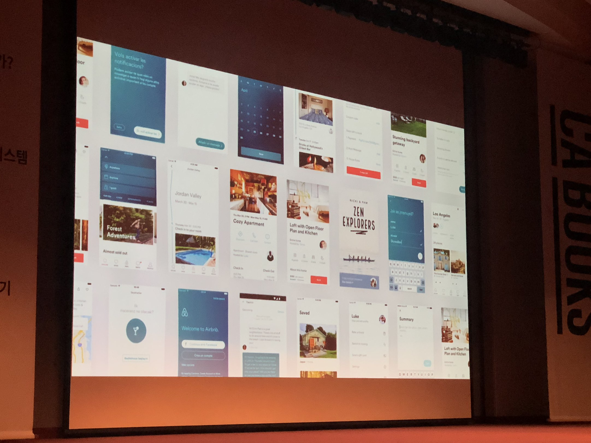

#### # 그래서 접근성이 뭐냐?
전세계의 모든 유저가 웹/모바일을 통해서 서비스를 동등하게 누릴 수 있도록 해야합니다. 접근성은 장애를 가진사람만이 아니라 노인(ex. 노안), 어린이등 모두를 아우르기 위한 서비스의 기본이라고 생각하시면 됩니다  

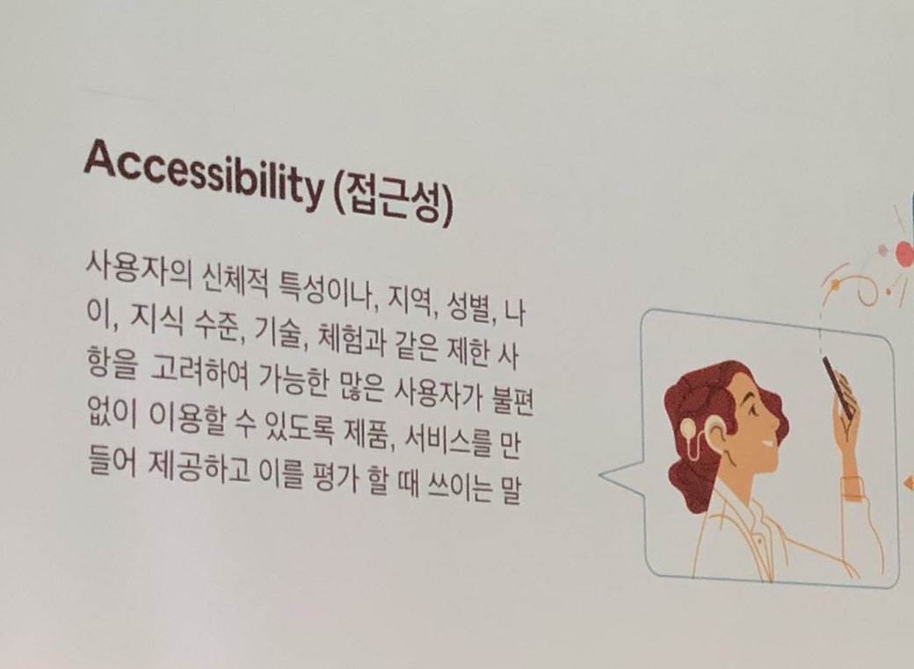
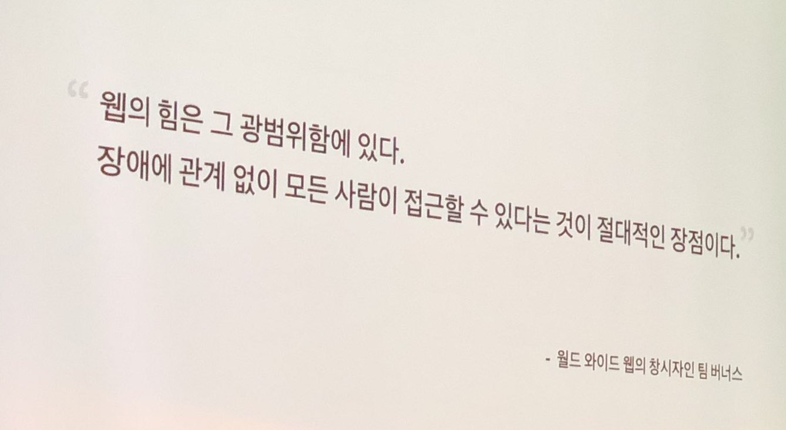

#### # ex. 버튼의 color-contrast
시력이 안좋은 사람이 봤을 때, Rausch컬러가 아무리 예쁘고 브랜드컬러라고 하지만 color-contrast가 접근성표준의 최소치(3:1)밖에 되지 않아서 접근성이 좋지 않다고 판단했다. Airbnb는 브랜드가치를 높게 가지고 있고 브랜드컬러를 많이 사용해야 했지만, **전세계의 모든사람들이 똑같이 서비스의 편의를 누리는데에 더 강한 목적**을 두기위해서 과감히 버튼에 Babu-color(청록색)를 사용하기로 결정했다.

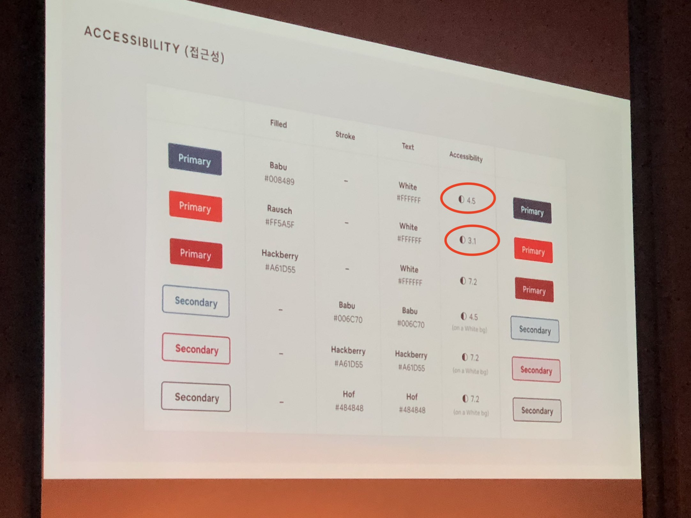
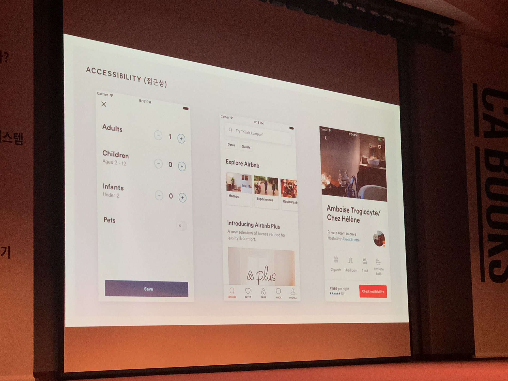

>[WCAG 2.0 지침이 전하는 전경색과 배경색의 명도 대비](http://naradesign.net/wp/2009/07/01/947/)
글꼴의 색과 문서의 배경 색이 어느 정도의 명도 대비를 지녀야 하는지에 대한 지침. 최소 3:1의 명암 비율을 가져야한다.

---

## 3. 디자인시스템 (Google, IBM, Shopify) 비교

- [Material Design System](https://material.io/design/) (Google)
  - 전세계적으로 가장 큰 디자인 팀을 가지고 있다고함 (50명)
  - 디자인시스템이란 어떻게 정의되야하는지 가장 디테일하게 가이딩해주는 곳. 디자인시스템의 바이블이라고 볼 수 있다
- [Carbon Design System](https://www.carbondesignsystem.com/) (IBM)
  - 디자이너-엔지니어 모두를 고려한 위한 가이드 (머터리얼은 엔지니어/디자이너를 위한 페이지가 각각 있음)
  - 머터리얼이 굉장히 많은 가이드가 장황하게 펼쳐있는데 반해, 간결하고 임팩트있는 내용들로 구성되어 있음
- [Polaris Design System](https://polaris.shopify.com/) (Shopify)
  - 전자상거래 3위를 달리고 있는곳. 아마존 전자상거래와 비슷
  - 독특한점. 컴포넌트들을 액션으로 묶어 가이딩함
  
  
#### # 독자적인 Airbnb만의 디자인시스템
에어비앤비는 안드로이드라고 구글 가이드라인을, IOS라고 애플 가이드라인을 따르지 않는다. 에어비앤비만의 독자적인 디자인 시스템을 적용하여 기기변경시에도 서비스 사용에 혼동을 주지 않고, 일관된 경험을 주기 위해 비슷한 톤, 배치의 디자인을 유지한다

**# Before**  
디자인시스템 도입전, 디바이스별 플랫폼별 제 각각이던 디자인. 일관된 유저경험을 주지 못함
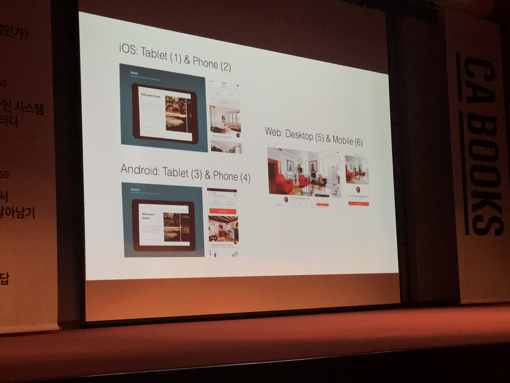

**# After**  
디자인시스템 도입후, 여러사람이 디자인하더라도 한사람이 디자인한 것 처럼 만들어낸 듯함. 일관된 유저경험 제공
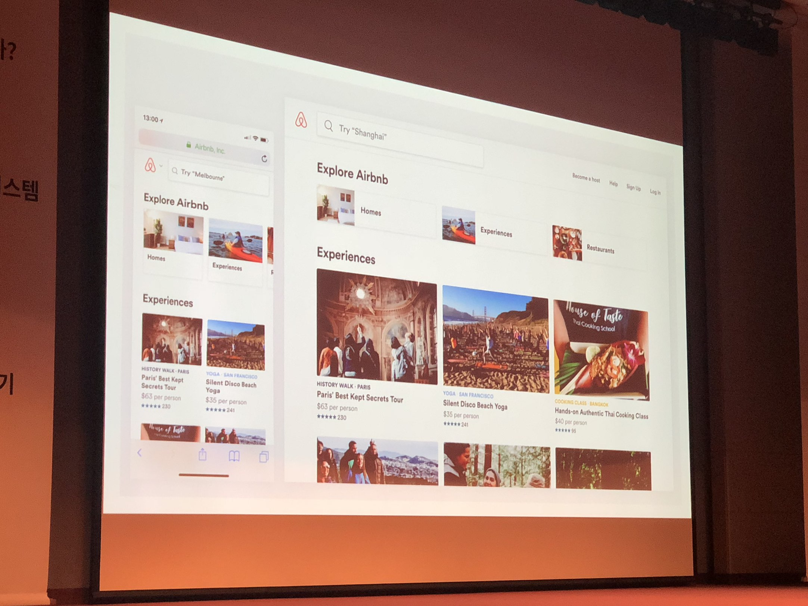

---

## 마치며...
마지막으로 이번 세미나를 들으며 디자인시스템의 의미를 새길 수 있었던 말
**"디자인시스템은 조직에 있는 모든 사람들의 응집력 있는 문화를 함께 만들어가는 것"**

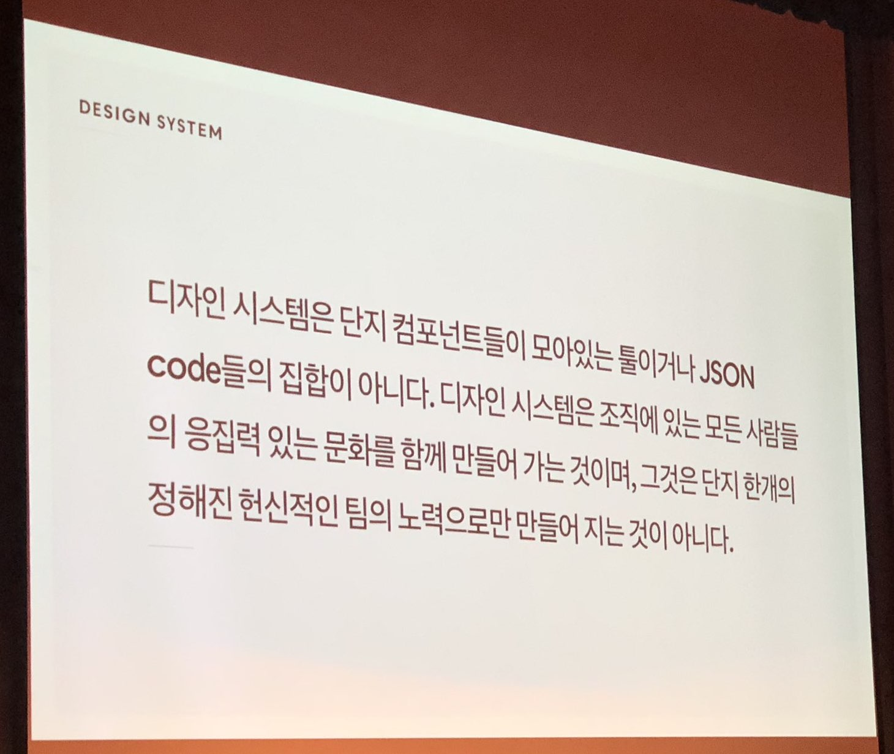
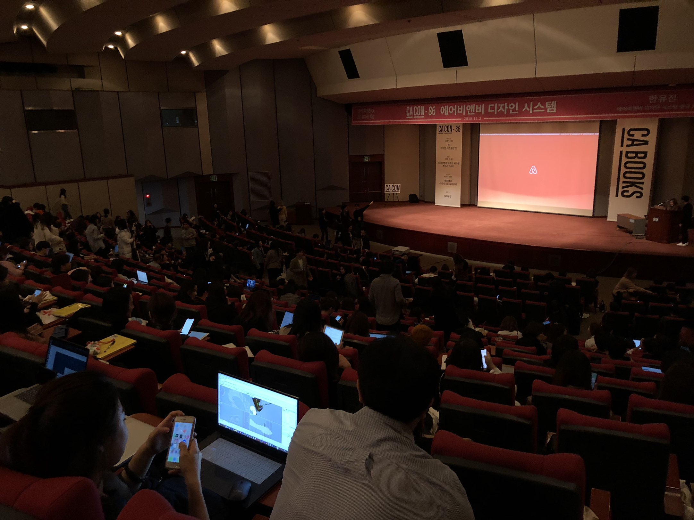